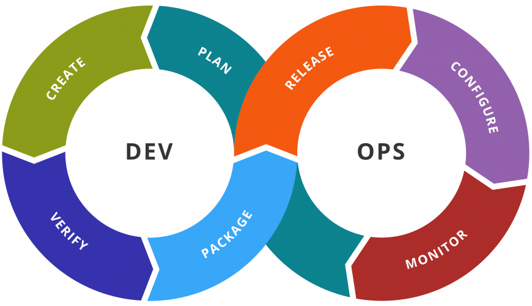

> DevOps is not a goal, but a never-ending process of continual improvement
>
> \- Jez Humble, Site Reliability Engineering at Google Cloud, co-author of The DevOps Handbook

Before attempting to define DevOps, let's first make it clear - Dev means software development and Ops means operations required to ship and maintain this software.

DevOps is an approach to bring both, the development and the operations cycles together. As student developers, we are usually on the developer cycle - plan a new feature, build it, push it - deployment and similar operations usually come last. However, DevOps advocates for practices wherein each new development in the software is followed by a series of steps such as configuration, deployment, monitoring, quality assurance, and a lot more.

But why do such operations need to be coupled with the development cycle? To increase velocity of delivering new features of a project with CI/CD and automation. Companies like Google and Meta make more than 10000 production pushes in a day across services; this is made possible by adopting DevOps practices, for e.g. according to this [talk](https://www.youtube.com/watch?v=ZzLa0YEbGIY) in 2018, Amazon makes a production push every 11.6 seconds! It also helps to create reliable applications, for example, if you detect an issue or bug in production, a minimal change can be quickly reflected if you have a CI/CD pipeline in place.

How do we implement the DevOps cycle? For the operations cycle to be integrated with software development, there need to be technologies that allow us to package, configure and easily deploy our code. Containerization is an approach that is widely adopted for the same. And what technology pioneered the use of containers? - **D**ocker!
