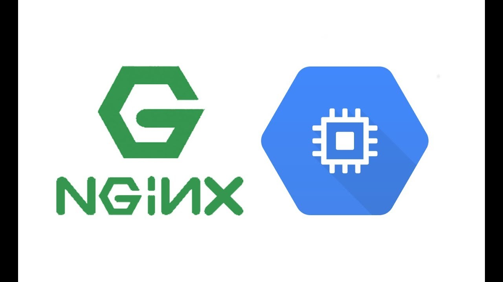

NGINX brings power and control to your Google Cloud Platform (GCP) environment so you can operate services and deliver content at the high standard your customers and developers demand.

NGINX Plus operates stand‑alone or can integrate with GCP services – such as existing load balancing solutions – to reduce your application delivery and management costs. NGINX Plus provides enterprise‑grade features such as session persistence, configuration via API, and active health checks so that you can add advanced application load balancing, monitoring, and management to your GCP application stack. Use Packer, Terraform, and NGINX Plus to implement high‑availability, all‑active, autoscaling solutions on Google Compute Engine.

### Learn

- This [article](https://cloud.google.com/community/tutorials/https-load-balancing-nginx) gives an overview of how Nginx can be used in Load Balancing.

- Read more about [Nginx in GCP](https://www.nginx.com/partners/google-cloud-platform/)
