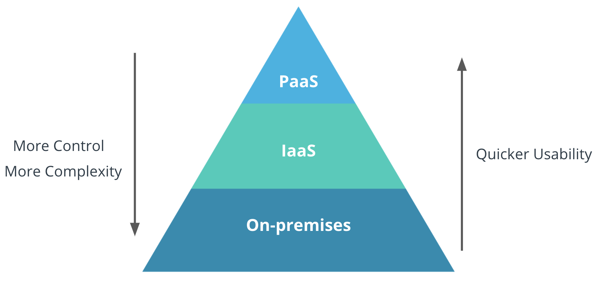

> If you’re an application developer you should be playing with PaaS now. (Organizations) are doing your developers a disservice if they’re not playing with PaaS.
>
> \- Steven Pousty, Developer Experience Engineer, Tanzu - VMWare

Platform-as-a-Service (PaaS) provides a cloud-based platform for developing, deploying, and managing applications. In contrast to the IaaS offering such as [Google Compute Engine]( "Google Compute Engine"), the developer does not have to directly manage, configure the underlying hardware to develop their applications. For a PaaS, the cloud services provider hosts, manages, and maintains all the hardware and software included in the platform - servers (for development, testing and deployment), operating system (OS) software, storage, networking, databases, middleware, runtime, frameworks, development tools - as well as related services for security, operating system and software upgrades, backups and more.

### Benefits of PaaS

- **Faster time to market**: PaaS enables development teams to spin-up development, testing and production environments in minutes, vs. weeks or months.

- **Low to no-risk testing and adoption of new technologies**: PaaS platforms typically include access to a wide range of the latest resources up and down the application stack. This allows companies to test new operating systems, languages, and other tools without having to make substantial investments in them, or in the infrastructure required to run them.

- **Simplified collaboration**: As a cloud-based service, PaaS provides a shared software development environment, giving development and operations teams access to all the tools they need, from anywhere with an Internet connection.

- **A more scalable approach**: With PaaS, organizations can purchase additional capacity for building, testing, staging and running applications whenever they need it.
  Less to manage: PaaS  offloads infrastructure management, patches, updates and other administrative tasks to the cloud service provider.

### IaaS or PaaS?

Here's how you can decide which service to choose for building your application:

The following graphic shows the different resources to be managed when developing on-premises, i.e., developing with one's own infrastructure, IaaS, or PaaS.

Depending upon how much control a developer needs on the infrastructure, the right service can be chosen.

### Try PaaS

The easiest way for a student developer to get started with using cloud is by deploying and managing their application on a PaaS offering.

- Google Cloud's PaaS offering has been covered in [App Engine]( "App Engine") under the Automation section.

- One of the most widely used PaaS offerings is [Heroku](https://www.heroku.com/platform) by Salesforce.

- [OpenShift](https://www.redhat.com/en/technologies/cloud-computing/openshift) by Red Hat is widely used by enterprises as it provides container orchestration services as well.
